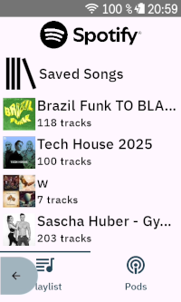
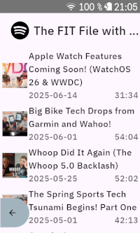
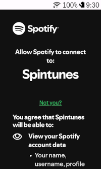

# Karoo Spintunes Extension

This extension for Karoo devices adds a graphical data field with Spotify music controls that can be added to data pages.

Compatible with Karoo 2 and Karoo 3 devices.

## Features

- Play/pause, skip forward, skip backward, shuffle, repeat, add to queue, view and play playlist, view queue
- Thumbnails for currently played track and playlists
- If Spotify is installed on your Karoo: Volume control, automatic volume control based on ride speed
- To be implemented: search, view album, view artist, podcast selection

## Installation

There are two ways to use this app:

- Remote control mode: You can install this extension on your Karoo and control Spotify running on your phone (or any other spotify connect enabled device like your computer if you are training indoors). The extension will control the Spotify app via the Spotify Web API, so you need an active internet connection (which is provided by the companion app as long as your phone has mobile data reception). Volume control is not available in this mode.
- Standalone mode: If you have sideloaded Spotify itself onto your Karoo, the extension can be used to directly control the Spotify app, which works without an internet connection. You can then directly pair your bluetooth headphones to the Karoo and thereby also get the radar alerts, TBT sounds etc the Karoo can play over bluetooth. Please note that the Spotify app can not use the companion app to stream new songs while riding, so you have to download the playlists you want to listen to using the Spotify app itself and let it synchronize them while you are within WiFi range.

## Usage

After installing this app on your Karoo and opening it once from the main menu, you can add a player data field to one of your data pages. It is recommended to use a data field that covers a whole page.

## Credits

- Icons are from [boxicons.com](https://boxicons.com) ([MIT-licensed](icon_credits.txt))
- Uses [Spotify Android SDK](https://github.com/spotify/android-sdk) (Apache2-licensed)
- Interfaces with the [Spotify Web API](https://developer.spotify.com/documentation/web-api/)
- Uses [karoo-ext](https://github.com/hammerheadnav/karoo-ext) (Apache2-licensed)
